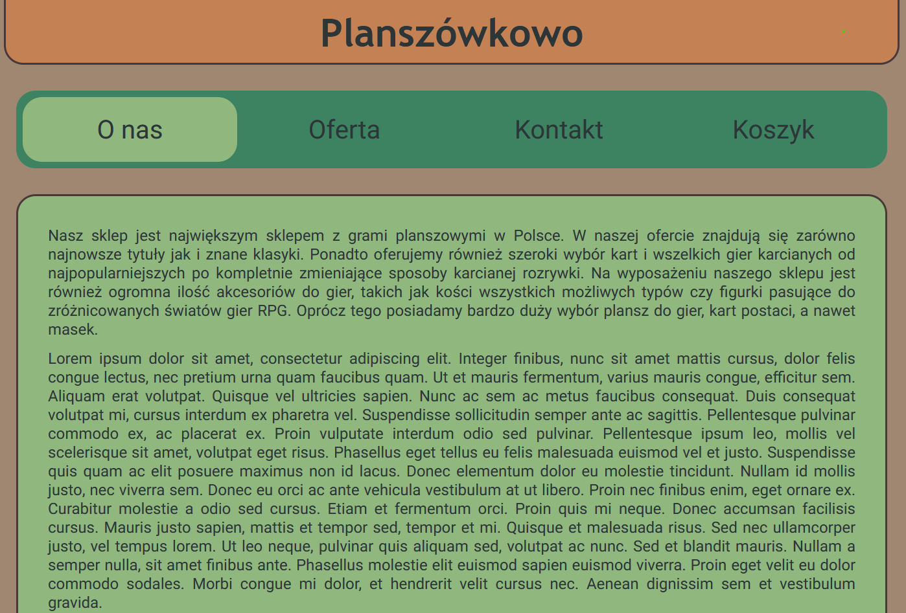
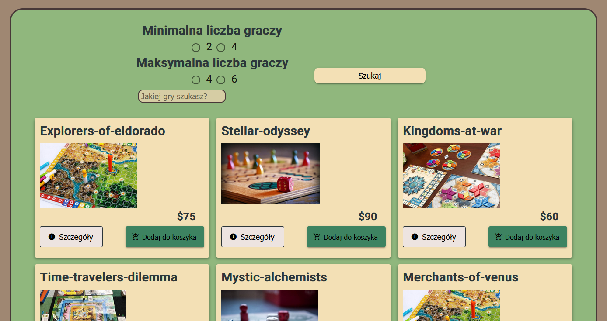
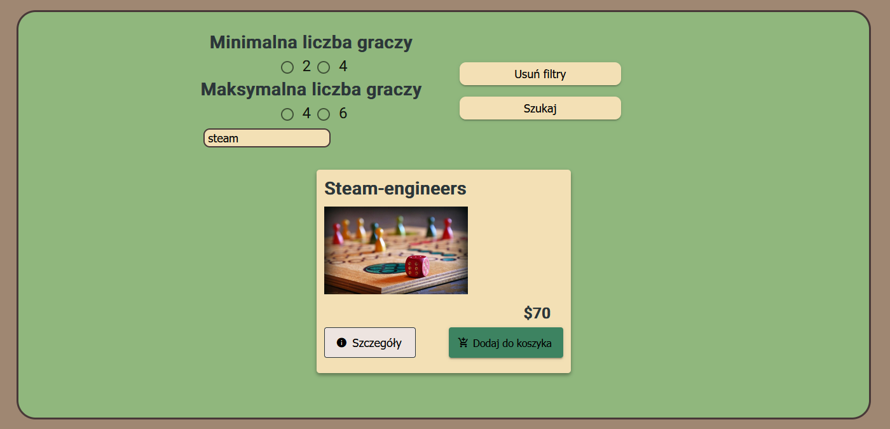
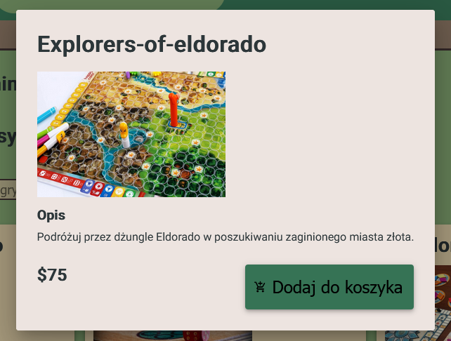
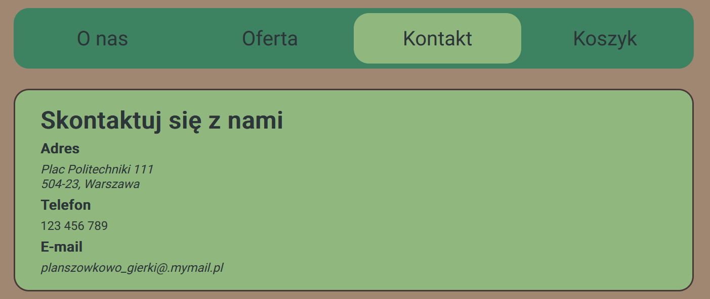
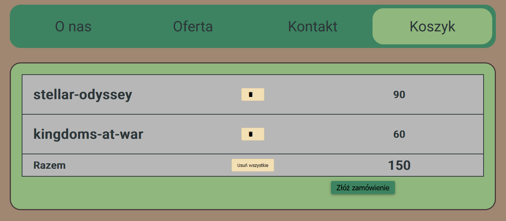
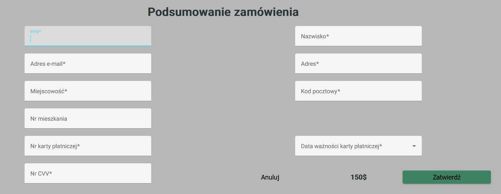

# Planszowo

Board games online store app. It is project for studies and my first project made using Angular. I had connection to external API to display real boardgames, but unfortunately it was closed. That's why all games shown in the offer page are just placeholders now. For UI I used Angular Material components and my own styles as well. 

Hosted page: https://planszowo-lpsylwr0s-pioter17.vercel.app

  
Click to see short summary & images

  
  ### Home page
  Home page with some placeholder text about the store history and mission.
  

  ### Offer page
  Offer page with display of available board games and some basic filters.
  

  You can use filters e.g to search for something specific.
  

  Each product can be added to cart. You can also check the game details.
  

  ### Contact page
  Another page with some placeholder address and contact data (everything is made up here).
  

  ### Cart page
  You can see every game that you added to the cart here, delete it from cart and make an order.
  

  If you choose to make an order you will be given form to fill.
  

 

## Development server

This project was generated with [Angular CLI](https://github.com/angular/angular-cli) version 15.0.0.  
Run `ng serve` for a dev server. Navigate to `http://localhost:4200/`. The application will automatically reload if you change any of the source files.

## Build

Run `ng build` to build the project. The build artifacts will be stored in the `dist/` directory.

